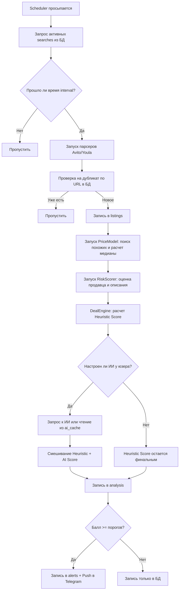

# Техническая документация проекта: Market Agent v3 (SaaS Multi-User) 🤖

**Market Agent v3** — это многопользовательская (SaaS) программная платформа для автоматического поиска, мониторинга, анализа и оценки объявлений на торговых площадках **Авито** и **Юла**. Проект использует двухэтапную оценку выгодности сделок (эвристический анализ + ИИ) и уведомляет пользователей в Telegram.

---

## 1. Архитектура системы

Платформа спроектирована как распределённый сервис на базе независимых демонов, работающих с общей базой данных SQLite в режиме WAL (Write-Ahead Logging).

```
                 +---------------------------------------+
                 |       Telegram Bot Interface          |
                 |      (Multi-User Wizard, Admin)       |
                 +-------------------+-------------------+
                                     |
                                     v
+-------------------+    +-----------+-----------+    +-------------------+
|   Web Dashboard   |--->|    SQLite DB (WAL)    |<---| Collector Daemon  |
|  (FastAPI + Jinja)|    | (schema.py + db.py)   |    | (Playwright + BS4)|
+-------------------+    +-----------------------+    +-------------------+
                                     ^
                                     |
                         +-----------+-----------+
                         |  Deal Scoring Engine  |
                         |  (Heuristics + AI)    |
                         +-----------------------+
```

### Основные компоненты:
1. **База данных (SQLite)**: Ядро системы, содержащее всю информацию о пользователях, настройках, поисковых запросах, собранных объявлениях, результатах анализа и логах уведомлений.
2. **Сборщик (Collector & Scheduler)**: Фоновый демон, который периодически опрашивает Авито и Юлу по активным поисковым запросам пользователей, используя headless-браузеры.
3. **Оценщик сделок (Deal Engine & AI Scorer)**: Вычисляет "Deal Score" (0–100) на основе сравнения цен с рыночной медианой, проверяет риски и генерирует ИИ-анализ.
4. **Telegram Bot**: Интерфейс взаимодействия с пользователем (создание поисков, управление подпиской, личный ИИ-продукт, настройки уведомлений).
5. **Web-панель (Dashboard)**: Административная веб-страница со статистикой системы.

---

## 2. Логическая структура компонентов

### 2.1 Сборщик (`collector/`)
Оркестрируется классом `Scheduler` в [scheduler.py](file:///d:/!AiSite/avito/collector/scheduler.py):
* **Многопользовательское расписание**: Каждые 30 секунд цикл проверяет активные поиски всех пользователей.
* **Соблюдение интервалов**: Выполняет поиск по конкретному запросу только если прошло больше `collector_interval_sec` (задаётся пользователем в настройках) с момента последнего запуска.
* **Интегрированные парсеры**:
  - `AvitoCollector` ([avito.py](file:///d:/!AiSite/avito/collector/avito.py)): Playwright-скрапер. Оптимизирован для скорости: блокирует картинки, шрифты и стили для экономии трафика. Подменяет User-Agent и локаль, выдерживает паузы (`playwright_slow_mo`).
  - `YulaCollector` ([youla.py](file:///d:/!AiSite/avito/collector/youla.py)): Аналогичный Playwright-скрапер для Юлы с фильтрацией по городам и категориям.

### 2.2 Оценщик (`analyzer/`)
* **Оценка цен (`PriceModel`)** в [price.py](file:///d:/!AiSite/avito/analyzer/price.py): Выбирает из БД до 200 похожих объявлений в том же ценовом диапазоне. Вычисляет среднюю, медиану, стандартное отклонение и перцентили цен (p10, p25, p75, p90). Требует минимум `min_listings_for_analysis` (по умолчанию 5) похожих записей для расчёта.
* **Оценка рисков (`RiskScorer`)** в [risk.py](file:///d:/!AiSite/avito/analyzer/risk.py): Проверяет рейтинг продавца, количество сделок, срок регистрации, наличие подробного описания и фотографий. Снижает общую оценку сделки (до -30%) при обнаружении подозрений на мошенничество.
* **Движок оценки (`DealEngine`)** в [engine.py](file:///d:/!AiSite/avito/analyzer/engine.py):
  Вычисляет эвристический балл на основе формулы:
  $$\text{Score} = 0.5 \times \text{PriceScore} - 0.3 \times \text{RiskScore} + 0.2 \times \text{QualityScore}$$
  где `PriceScore` основан на отклонении цены от рыночной медианы.
* **ИИ-анализатор (`AIScorer`)** в [ai_scorer.py](file:///d:/!AiSite/avito/analyzer/ai_scorer.py):
  Интегрирует LLM для детальной оценки. Если ИИ уверен в выгодности сделки (confidence > 0.6), он корректирует (блендит) итоговый балл:
  $$\text{BlendedScore} = 0.6 \times \text{HeuristicScore} + 0.4 \times \text{AIScore}$$

### 2.3 Модуль ИИ (`ai/`)
Фабрика [factory.py](file:///d:/!AiSite/avito/ai/factory.py) динамически создает провайдеры на основе настроек пользователя:
* **WormSoft AI** ([wormsoft_provider.py](file:///d:/!AiSite/avito/ai/wormsoft_provider.py)) — основная модель по себестоимости через шлюз WormSoft.
* **OpenAI GPT** ([openai_provider.py](file:///d:/!AiSite/avito/ai/openai_provider.py))
* **Google Gemini** ([gemini_provider.py](file:///d:/!AiSite/avito/ai/gemini_provider.py))
* **Anthropic Claude** ([anthropic_provider.py](file:///d:/!AiSite/avito/ai/anthropic_provider.py))

Для экономии токенов используется таблица `ai_cache`, которая кэширует результаты анализа объявлений на 24 часа.

---

## 3. Схема базы данных (SQLite)

База данных инициализируется скриптом [database/schema.py](file:///d:/!AiSite/avito/database/schema.py) и включает следующие таблицы:

| Таблица | Описание | Основные поля |
| :--- | :--- | :--- |
| `users` | Учётные записи пользователей | `id`, `telegram_id`, `username`, `is_active` (бан), `is_admin`, `plan` (free/pro), `onboarded` |
| `user_settings`| Индивидуальные параметры поиска и ИИ | `user_id`, `city`, `sources_avito/youla`, `collector_interval_sec`, `threshold_buy/maybe`, `hunter_enabled`, `ai_provider`, `ai_api_key`, `ai_model`, `notify_quiet_hours_start/end` |
| `searches` | Активные поисковые запросы | `id`, `user_id`, `query`, `min_price`, `max_price`, `location`, `active` (0/1) |
| `listings` | Все спарсенные объявления | `id`, `source` (avito/youla), `title`, `price`, `url`, `images`, `seller_name`, `parsed_at`, `published_at` |
| `analysis` | Результаты оценки выгодности | `id`, `listing_id`, `market_price`, `price_delta_pct`, `deal_score`, `risk_score`, `ai_score`, `ai_explanation`, `ai_why_good`, `ai_risks` |
| `alerts` | История отправленных уведомлений | `id`, `user_id`, `analysis_id`, `sent_at` |
| `saved_finds` | Избранные объявления пользователей | `user_id`, `listing_id`, `analysis_id`, `note`, `saved_at` |
| `market_radar` | Статистика трендов цен по категориям | `user_id`, `category`, `avg_price`, `median_price`, `trend` (rising/falling/stable), `trend_pct` |
| `ai_cache` | Кэш запросов к языковым моделям | `cache_key` (хэш параметров), `provider`, `response`, `created_at` |
| `broadcasts` | Админские рассылки пользователям | `id`, `admin_id`, `message`, `sent_count`, `created_at` |

---

## 4. Алгоритмы и логические процессы

### 4.1 Конвейер сбора и анализа объявлений:


### 4.2 Процесс онбординга пользователя:
При отправке команды `/start` бот проверяет флаг `onboarded` в таблице `users`. Если он равен `0`:
1. Бот запрашивает **город** (записывается в `user_settings.city`).
2. Предлагает выбрать **ИИ-провайдера** (WormSoft AI, OpenAI, Gemini, Anthropic или без ИИ).
3. При выборе внешнего ИИ запрашивает соответствующий **API-ключ**.
4. После завершения проставляет `onboarded = 1` и открывает Главное меню.

---

## 5. Инфраструктурные настройки (`.env`)

Все параметры уровня инфраструктуры сервера настраиваются через переменные среды в файле `.env`:

* `MA_TELEGRAM_BOT_TOKEN`: Уникальный токен Telegram бота.
* `MA_ADMIN_TELEGRAM_ID`: ID администратора (для доступа к админ-панели `/admin`).
* `MA_DB_PATH`: Путь к файлу базы данных SQLite (по умолчанию `data/market_agent.db`).
* `MA_DASHBOARD_PORT`: Порт для FastAPI дашборда (по умолчанию `8080`).
* `MA_PLAYWRIGHT_HEADLESS`: Запуск браузера в скрытом режиме (true/false).
* `MA_PLAYWRIGHT_SLOW_MO`: Искусственная задержка Playwright в миллисекундах (защита от банов).
* `MA_PROXY_URL`: Прокси-сервер (SOCKS5/HTTP) для обхода ограничений.
* `MA_WORMSOFT_API_KEY`: Ключ глобального fallback-провайдера WormSoft AI.

---

## 6. Запуск и управление

### Системные требования:
* Python 3.8+
* Установленный Playwright Chromium (`python -m playwright install chromium`)

### Команды CLI:
```bash
python main.py init        # Инициализация базы данных и запуск миграций
python main.py status      # Показать общую статистику базы данных
python main.py collect     # Запуск демона сбора объявлений
python main.py bot         # Запуск Telegram-бота
python main.py dashboard   # Запуск локальной веб-панели управления
```
