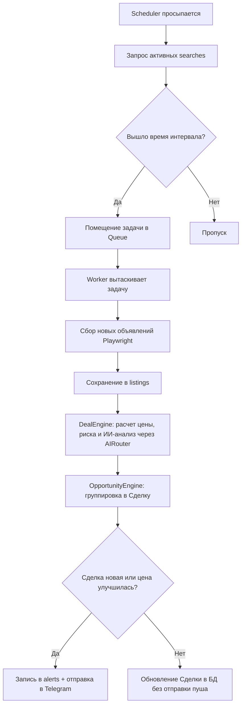

# Техническая документация проекта: Market Agent v4 (SaaS Production-Ready) 🤖

**Market Agent v4** — это многопользовательская (SaaS) программная платформа для автоматического поиска, мониторинга, анализа и оценки объявлений на торговых площадках **Авито** и **Юла**. 

Главное отличие v4 от прошлых версий — концептуальный переход от мониторинга сырых объявлений к **выявлению бизнес-возможностей (Opportunities)**, а также внедрение полноценного пула асинхронных воркеров и абстрактного слоя баз данных для масштабирования под SaaS.

---

## 1. Архитектура системы (SaaS v4)

Платформа спроектирована по событийно-ориентированной схеме с пулом асинхронных воркеров и разделением ролей баз данных.

```
                  +---------------------------------------+
                  |       Telegram Bot Interface          |
                  |      (Multi-User Wizard, Admin)       |
                  +-------------------+-------------------+
                                      |
                                      v
+-------------------+    +-----------+-----------+    +---------------------------+
|   Web Dashboard   |--->|    Database Factory   |<---|    Collector Daemon       |
| (Landing/LK/Admin)|    |     (db.py Interface) |    | (Queue + Max Workers Pool)|
+-------------------+    +-----------+-----------+    +---------------------------+
                                     |
                                     +---> [SQLiteWAL]
                                     +---> [PostgreSQL (Future Expansion)]
```

### Основные компоненты:
1. **Абстрактный слой БД (`database/`)**:
   * `BaseDatabase` ([base.py](file:///d:/!AiSite/avito/database/base.py)) — абстрактный интерфейс для всех CRUD-операций.
   * `SQLiteDatabase` ([sqlite.py](file:///d:/!AiSite/avito/database/sqlite.py)) — реализация на SQLite с поддержкой WAL режима.
   * `PostgresDatabase` ([postgres.py](file:///d:/!AiSite/avito/database/postgres.py)) — заготовка драйвера PostgreSQL для масштабирования SaaS.
   * `Database` ([db.py](file:///d:/!AiSite/avito/database/db.py)) — прозрачная фабрика, выбирающая драйвер на основе переменной среды `MA_DATABASE_TYPE`.
2. **Асинхронная очередь и пул воркеров (`collector/scheduler.py`)**:
   * Демон сборщика разделен на **Producer** (заполняет очередь задач `asyncio.Queue` созревшими поисковыми запросами) и **Consumer Pool** (пул параллельных воркеров `#0`, `#1`..., размер регулируется `MA_MAX_WORKERS`).
   * Каждый воркер имеет **изолированную браузерную сессию** Playwright для предотвращения конфликтов.
3. **Оценщик возможностей (`OpportunityEngine`)** в [opportunity.py](file:///d:/!AiSite/avito/analyzer/opportunity.py):
   * Группирует схожие и дублирующие объявления от разных продавцов в единую коммерческую **Сделку (Opportunity)**.
   * Отсекает спам-уведомления: пользователь получает оповещение только о новой Сделке или об улучшении цены/качества существующей.
4. **Умный AI Роутер (`AIRouter`)** в [router.py](file:///d:/!AiSite/avito/ai/router.py):
   * Защищает систему от сбоев API: если персональный API-ключ пользователя заблокирован или исчерпан лимит, роутер автоматически переключает запрос на резервный глобальный ключ администратора.
   * Рассчитывает **Уверенность (Confidence)** оценки сделки и **Ликвидность рынка (Market Liquidity)**.

---

## 2. Логическая структура компонентов

### 2.1 Сборщик и Пул Воркеров (`collector/`)
Оркестрируется классом `Scheduler` в [scheduler.py](file:///d:/!AiSite/avito/collector/scheduler.py):
* **Асинхронная Очередь**: Задачи на парсинг отправляются в `asyncio.Queue`. Набор активных обработчиков отслеживается в `self._active_processing_searches` для исключения дублирования.
* **Изолированный скрапинг**:
  - `AvitoCollector` ([avito.py](file:///d:/!AiSite/avito/collector/avito.py)): Playwright-скрапер. Блокирует картинки, шрифты и медиафайлы для экономии трафика.
  - `YulaCollector` ([youla.py](file:///d:/!AiSite/avito/collector/youla.py)): Аналогичный Playwright-скрапер для Юлы.

### 2.2 Оценщик сделок и группировщик (`analyzer/`)
* **Сделки (`OpportunityEngine`)**:
  - Сопоставляет новые объявления с имеющимися возможностями по близости цены и схожести заголовков/ключевых слов.
  - Пересчитывает среднюю цену, лучшую цену, пересматривает Deal Score и инкрементирует счетчик продавцов (`listings_count`).
* **Умный AI Роутер (`AIRouter`)**:
  - Автоматически выбирает ИИ-провайдера (WormSoft AI, OpenAI, Gemini, Anthropic).
  - На основе количества похожих объявлений в БД вычисляет ликвидность товара (`low`, `medium`, `high`).
* **Движок оценки (`DealEngine`)** в [engine.py](file:///d:/!AiSite/avito/analyzer/engine.py) совмещает эвристический и ИИ-анализ для выдачи итогового Score.

---

## 3. Схема базы данных

База данных включает следующие основные таблицы (создаются через [database/schema.py](file:///d:/!AiSite/avito/database/schema.py)):

| Таблица | Описание | Основные поля |
| :--- | :--- | :--- |
| `users` | Учётные записи пользователей | `id`, `telegram_id`, `username`, `is_active` (бан), `plan` (free/pro/unlimited), `onboarded` |
| `user_settings`| Индивидуальные настройки пользователя | `user_id`, `city`, `sources_avito/youla`, `ai_provider`, `ai_api_key`, `ai_model`, `notify_quiet_hours_start/end`, `hunter_min_score` |
| `searches` | Активные поисковые запросы | `id`, `user_id`, `query`, `min_price`, `max_price`, `location`, `active` (0/1) |
| `opportunities`| Группированные выгодные сделки | `id`, `user_id`, `title`, `best_price`, `avg_price`, `median_price`, `deal_score`, `confidence`, `market_liquidity`, `listings_count` |
| `listings` | Спарсенные объявления (сырые данные) | `id`, `opportunity_id` (FK), `source`, `title`, `price`, `url`, `seller_name`, `parsed_at` |
| `analysis` | Результаты оценки выгодности | `id`, `listing_id`, `market_price`, `deal_score`, `risk_score`, `ai_explanation`, `confidence`, `market_liquidity` |
| `alerts` | История отправленных уведомлений | `id`, `user_id`, `analysis_id`, `sent_at` |

---

## 4. Логические процессы v4

### 4.1 Конвейер сбора, анализа и группировки:


### 4.2 Персональные оповещения в Telegram:
Вместо спама о каждом объявлении бот присылает красивую HTML-карточку с данными сделки:
* **AI Оценка**: оценка выгодности от 0 до 100.
* **Уверенность**: точность анализа в процентах.
* **Ликвидность**: прогноз скорости перепродажи.
* **Количество продавцов**: указывает, сколько продавцов предлагают этот товар (детектор дубликатов).

---

## 5. SaaS Web Dashboard (Разделенные панели)

Веб-интерфейс ([dashboard/app.py](file:///d:/!AiSite/avito/dashboard/app.py)) полностью разделен для обеспечения многопользовательского опыта:

1. **SaaS Landing Page (`/`)**:
   * Промо-страница с описанием платформы, анимациями и интерактивной формой авторизации по Telegram ID.
2. **Личный кабинет пользователя (`/dashboard/{telegram_id}`)**:
   * Статистика пользователя: активные поиски, найденные возможности, сэкономленный бюджет.
   * Лента активных сделок (Opportunities) с подсветкой Score (buy/maybe/skip) и ссылками на оригиналы.
   * Последние снимки радара цен (Market Radar) по категориям.
3. **Глобальная админ-панель (`/admin`)**:
   * Метрики системы: общее число юзеров, статистика тарифов, нагрузка на воркеры.
   * Таблица управления пользователями: смена тарифов (Free / Pro / Unlimited) и бан-система.

---

## 6. Запуск и управление

### Системные требования:
* Python 3.8+
* Установленный Playwright Chromium (`python -m playwright install chromium`)

### Настройки `.env`:
* `MA_TELEGRAM_BOT_TOKEN`: Токен Telegram-бота.
* `MA_ADMIN_TELEGRAM_ID`: ID администратора для доступа к `/admin`.
* `MA_MAX_WORKERS`: Максимальное количество параллельно работающих браузеров (по умолчанию `2`).
* `MA_DATABASE_TYPE`: Тип СУБД (`sqlite` или `postgres`).

### Команды CLI:
```bash
python main.py init        # Инициализация базы данных и запуск миграций
python main.py status      # Показать общую статистику базы данных и статус
python main.py collect     # Запуск демона сбора объявлений (очередь воркеров)
python main.py bot         # Запуск Telegram-бота
python main.py dashboard   # Запуск веб-панели управления
```
